 

 
<!-- ⚡ Animated Typing -->

 

👋 Hey, I'm Prabaher!

I'm PRABAHER J, a 3rd Year B.Tech Artificial Intelligence & Data Science student passionate about turning ideas into practical software.

I enjoy working at the intersection of:

🤖 Artificial Intelligence & Machine Learning

👁️ Computer Vision

🌐 Full Stack Web Development

🐍 Python Development

☕ Java Development

🗄️ SQL & Databases

⚙️ APIs, Deployment & Automation

 

⚡ What I'm Currently Doing

<table>
<tr>
<td width="50%">

🤖 AI / ML

Exploring Machine Learning & Deep Learning

Building Computer Vision systems

Working with YOLO-based detection

Learning face recognition & embeddings

Experimenting with AI-powered applications

</td>
<td width="50%">

🌐 Full Stack

Building responsive web applications

Learning backend APIs

Working with Flask / FastAPI

Connecting applications with MySQL

Deploying projects using Vercel & Render

</td>
</tr>
</table>

🧰 Tech Arsenal

💻 Programming Languages

🌐 Web Development

⚙️ Backend & APIs

🗄️ Database

🤖 AI / Data

🛠️ Tools

 

🚀 Featured Projects

🚀 Project

🧠 What I Built

🔧 Main Technologies

🚦 Smart Surveillance

AI-based driver face recognition, license verification and automated fine workflow concept

Python • YOLO • OpenCV • ArcFace

📝 Student Feedback System

Full-stack feedback platform with student/admin flow and database storage

HTML • CSS • JS • FastAPI • MySQL

🎤 Audio Scam Finder

AI-focused project for analyzing audio and identifying suspicious/scam patterns

Python • AI/ML

🧑‍💻 Deepfake Project

Exploration of deepfake detection / AI-generated media analysis

Python • Deep Learning

🏫 Isha School Project

Web application project developed as a practical full-stack experience

HTML • CSS • JavaScript

📊 Project Pulse

Project / project-monitoring oriented application work

Web • AI concepts

🎨 Vibe Coding

Creative frontend experiments focused on animation, UI and responsive design

HTML • CSS • JavaScript

💡 I prefer projects that solve a real problem instead of projects that only demonstrate a technology.

🧠 My Learning Journey

                    ┌─────────────────────┐
                    │       PRABAHER      │
                    │     AI & DS Student │
                    └──────────┬──────────┘
                               │
              ┌────────────────┼────────────────┐
              ▼                ▼                ▼
          💻 Coding         🤖 AI/ML          🌐 Web
              │                │                │
         Python / Java     YOLO / CV       HTML / CSS / JS
         C / JavaScript    Deep Learning    Flask / FastAPI
              │                │                │
              └────────────────┼────────────────┘
                               ▼
                         🚀 Real Projects
                               │
                               ▼
                      🔥 Build • Deploy • Learn

📊 GitHub Activity

 

🐍 Contribution Animation

<b>Watch the contributions travel through the grid 🐍</b>

🏆 What I Like Building

🤖 AI Applications       ████████████████████
👁️ Computer Vision       ███████████████████░
🌐 Full Stack Apps        ██████████████████░░
🐍 Python Projects        ████████████████████
⚡ Creative Frontend      ████████████████░░░░
🧠 Learning New Tech     ████████████████████

🎯 My Goals

🚀 Become a strong AI & Software Development professional

🧠 Improve practical Machine Learning / Deep Learning skills

🌐 Build production-style full-stack applications

💡 Participate in more hackathons & coding competitions

🗣️ Improve communication, confidence and interview skills

🌍 Contribute to meaningful open-source projects

🔥 Keep building instead of only learning

🌐 Let's Connect

💭 Developer Mindset

 

⭐ Explore my repositories • Build something useful • Keep learning

 

  

